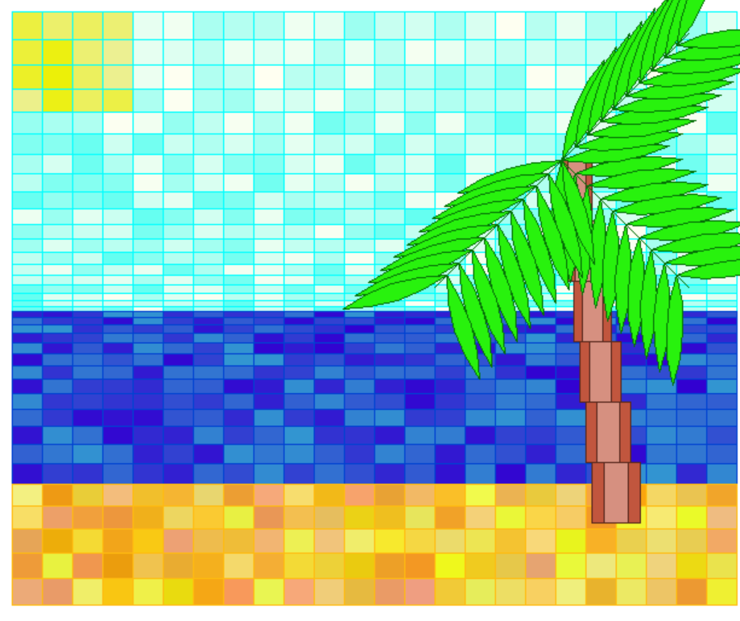
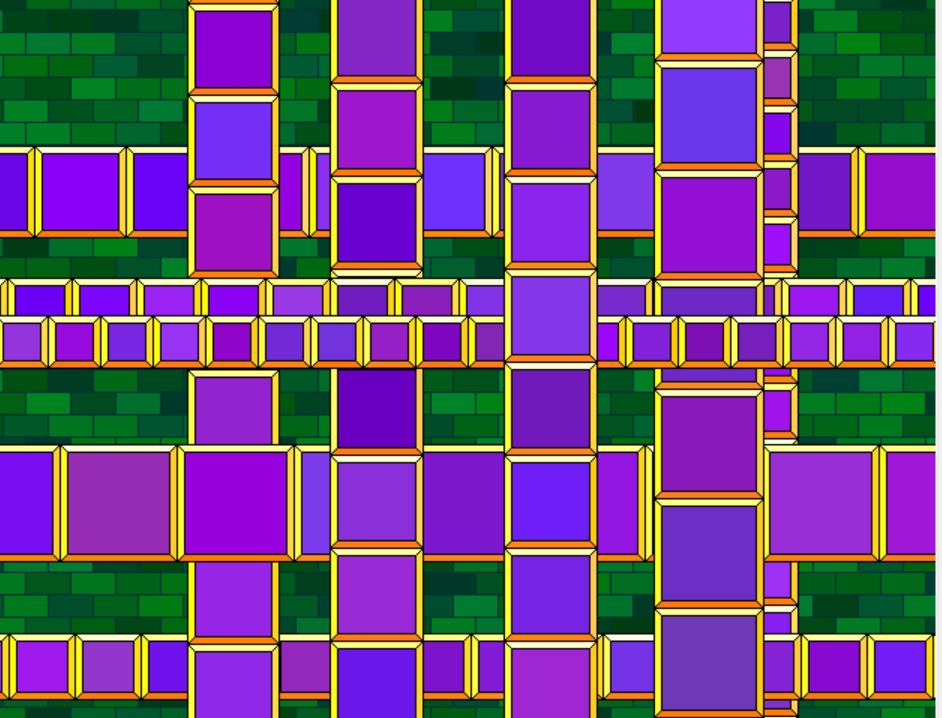

# Python-Turtle-Art
Collection of Python files that present semi-random images from the Turtle module

## This repo is composed of python files that create the following:
- "Python Beach, 2020" code-generated image of the seaside

- "Gems and Bands, 2020" semi randomly generated images, changes each time the file is run

All files run on Python 3.8 and the Pythom 3.8 IDLE
